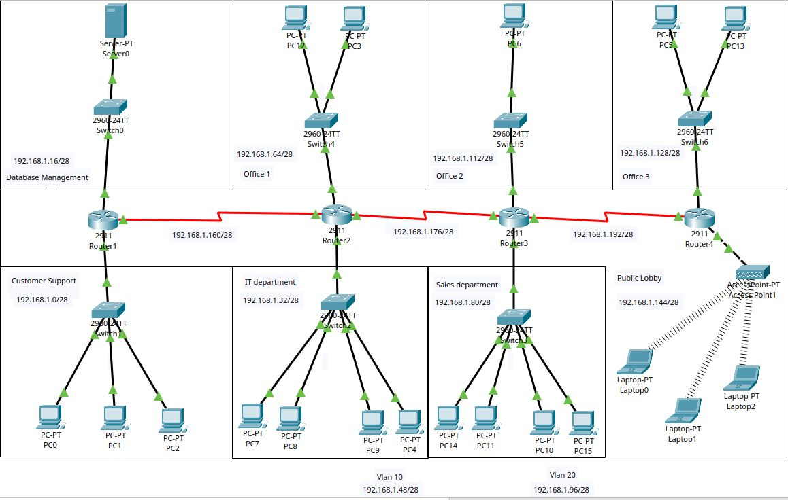

This project simulates an enterprise network built in Cisco Packet Tracer as preparation for the CCNA certification. It covers network planning, subnetting, VLAN segmentation, DHCP, Wi-Fi, port security, dynamic OSPF routing, and extensive use of standard and extended ACLs based on the principle of least privilege.

The topology includes multiple departments (IT, Sales, Customer Support, Offices, Database Management, and Public Wi-Fi), with controlled inter-network communication, router-on-a-stick configurations, and security-focused access restrictions. The project demonstrates practical Cisco IOS configuration, troubleshooting, and real-world network design concepts.

